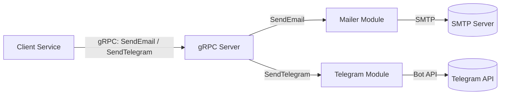

# Sandesh

`sandesh` is a lightweight Bun-based notification gateway exposed over gRPC.
It currently supports:

- Sending HTML emails through SMTP
- Sending HTML-formatted Telegram messages to configured chat IDs

## Architecture



## Features

- Single gRPC service (`MailerService`) for email and Telegram notifications
- App-aware email subject prefixing via `app_id`
- Fan-out Telegram delivery to multiple chat IDs
- Simple, env-driven setup with Bun runtime

## Tech Stack

- [Bun](https://bun.com) runtime
- `@grpc/grpc-js` + `@grpc/proto-loader` for gRPC server
- `nodemailer` for SMTP email delivery
- `node-telegram-bot-api` for Telegram delivery

## Project Structure

```text
src/
  grpc/
    server.ts          # gRPC server and handlers
    sandesh.proto      # gRPC contract
  mail/
    mail.ts            # nodemailer transporter
    send-html-mail.ts  # email send helper
  telegram/
    telegram.ts        # Telegram send helper
    id.ts              # Telegram chat IDs list
```

## Prerequisites

- Bun installed (`bun --version`)
- Reachable SMTP server credentials
- Telegram bot token
- At least one Telegram chat ID

## Installation

```bash
bun install
```

## Configuration

Create a `.env` file in the project root:

```env
SMTP_SERVER=smtp.example.com
SMTP_PORT=587
EMAIL_SENDER=your-smtp-username
EMAIL_PASSWORD=your-smtp-password
EMAIL_FROM=Your App <no-reply@example.com>
TELEGRAM_BOT_TOKEN=123456789:your_bot_token
```

Then set your Telegram recipients in `src/telegram/id.ts`.

## Run the Service

```bash
bun run src/grpc/server.ts
```

The server binds to `0.0.0.0:50052`.

## gRPC API

Service definition: `src/grpc/sandesh.proto`

```proto
service MailerService {
  rpc SendEmail (SendEmailRequest) returns (SendEmailResponse);
  rpc SendTelegram (SendTelegramRequest) returns (SendTelegramResponse);
}
```

### `SendEmail`

Request fields:

- `app_id` (`string`)
- `to` (`repeated string`)
- `subject` (`string`)
- `body` (`string`, HTML content)

Response:

- `success` (`bool`)

### `SendTelegram`

Request fields:

- `html` (`string`, Telegram HTML parse mode)

Response:

- `success` (`bool`)

## Example Calls (grpcurl)

`SendEmail`

```bash
grpcurl -plaintext \
  -d '{
    "app_id": "billing-service",
    "to": ["dev@example.com"],
    "subject": "Invoice generated",
    "body": "<b>Invoice #1024</b> is ready."
  }' \
  localhost:50052 sandesh.MailerService/SendEmail
```

`SendTelegram`

```bash
grpcurl -plaintext \
  -d '{"html":"<b>Deploy complete</b> for production"}' \
  localhost:50052 sandesh.MailerService/SendTelegram
```

## Notes

- Email subject format is: `[<app_id>] - <subject>`
- Telegram messages are sent to every ID in `src/telegram/id.ts`
- Handlers currently return `{ success: false }` on error without detailed error body
